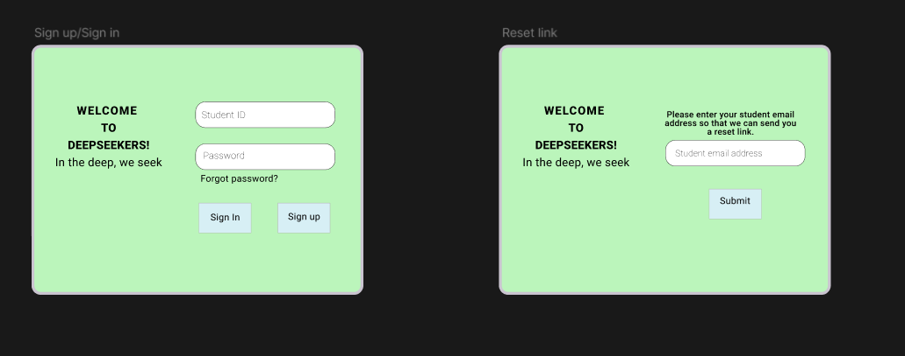
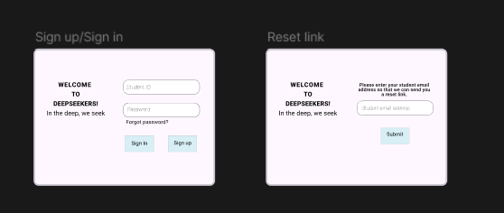
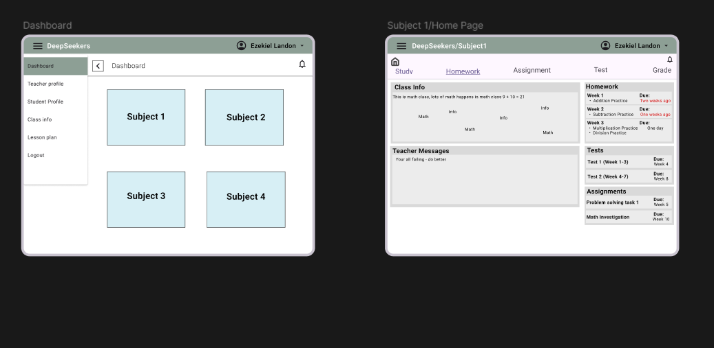
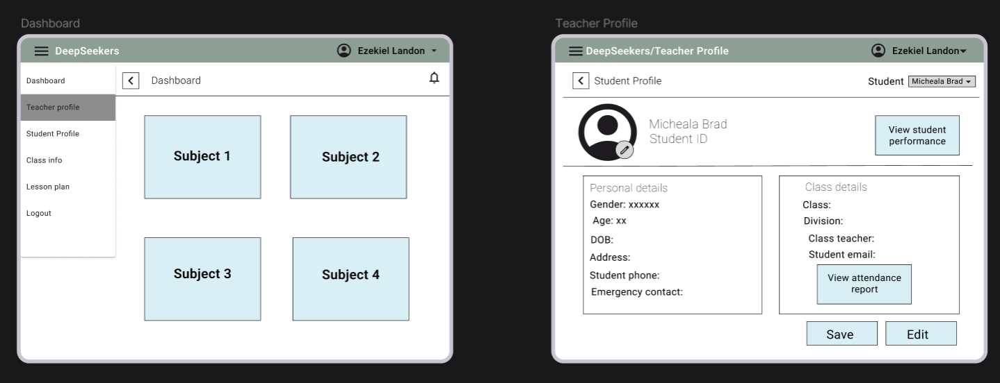
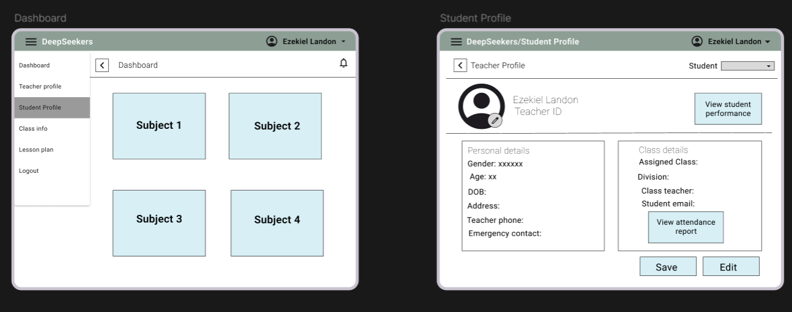
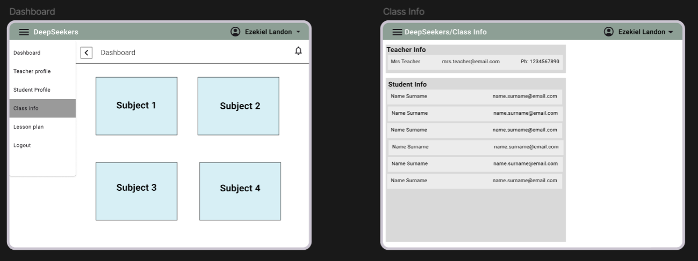

# Medium Fidelity UI Design
Available at : https://www.figma.com/design/p5rvD7GIvauciQH4mMsLdB/Medium-Fidelity-Prototype?node-id=0-1&t=q6TN8M0h8dDZIIxB-1
### Sign in & sign up page

### Student profile and dashboard

### Study page and Test page

### Updated sign in & sign up pg, with reset link

### Dashboard and home pg

### Study & homework, with AI helper

### Assignment & test with AI helper

### Grades

### Teacher profile

### Student profile

### Class info

### Lesson plan with AI helper
